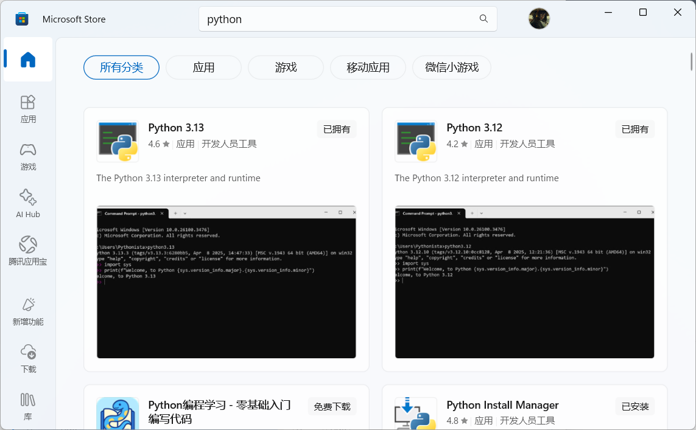
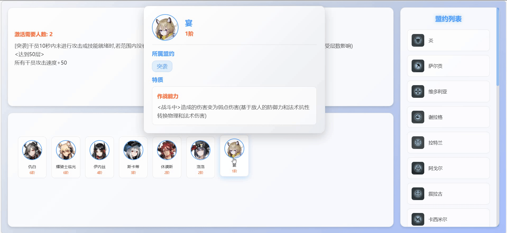

# 明日方舟-卫戍协议小工具

一个基于纯静态HTML的明日方舟卫戍协议干员和盟约信息展示网页，帮助萌新快速了解干员盟约信息，避免手忙脚乱。

## 快速开始

### 方法一：使用Python HTTP服务器（推荐）

1. 确保已安装Python 3.x
2. 在项目根目录运行：

```bash
python -m http.server 8080
```

如果没有安装python，可以直接打开powershell，输入：`python`，会跳转到Microsoft Store，安装python即可。或者直接使用Microsoft Store搜索安装。

3. 打开浏览器访问：`http://localhost:8080`



### 方法二：使用Node.js

```bash
npx http-server -p 8080
```

### 方法三：使用VS Code Live Server插件

1. 安装Live Server插件
2. 右键 `index.html`选择"Open with Live Server"

## 注意事项

⚠️ **重要**：请不要直接双击打开HTML文件，由于浏览器安全策略（CORS），无法从本地文件系统加载JSON数据，会导致页面无数据显示。

## 功能一览



## 功能特性

- 📋 **盟约列表** - 右侧显示所有盟约，包含图标和名称
- 📖 **盟约详情** - 点击盟约后在左侧显示详细信息
- 👥 **干员列表** - 显示属于选中盟约的所有干员，按阶位排序
- � **悬浮窗盟约点击** - 鼠标悬停干员头像显示悬浮窗，点击悬浮窗内的盟约标签可直接跳转到对应盟约
- 🀽� **干员详情** - 点击干员头像弹出详细信息模态框
- 🎨 **现代化UI** - 采用浅色主题，响应式设计
- 📱 **移动端适配** - 支持不同屏幕尺寸

## 技术栈

- **HTML5** - 语义化标记
- **CSS3** - 现代样式，包含渐变、阴影、动画效果
- **JavaScript (ES6+)** - 原生JavaScript，无框架依赖
- **JSON** - 数据存储格式

## 项目结构

```
明日方舟-卫戍协议/
├── index.html              # 主页面
├── data_干员.json          # 干员数据
├── data_盟约.json          # 盟约数据
├── images/                 # 图片资源
│   ├── 干员/              # 干员头像
│   └── 盟约/              # 盟约图标
└── README.md              # 说明文档
```

## 数据格式

### 盟约数据 (data_盟约.json)

```json
{
    "盟约名称": {
        "激活需要人数": "数字",
        "描述": "盟约效果描述"
    }
}
```

### 干员数据 (data_干员.json)

```json
{
    "干员名称": {
        "盟约": ["盟约1", "盟约2"],
        "特质": {
            "分类": "特质分类",
            "tag": ["触发条件"],
            "描述": "特质效果描述"
        },
        "阶位": "X阶"
    }
}
```

## 浏览器兼容性

- ✅ Chrome 60+
- ✅ Firefox 55+
- ✅ Safari 11+
- ✅ Edge 79+

## 自定义配置

### 添加新干员

1. 在 `data_干员.json`中添加干员信息
2. 将干员头像图片放入 `images/干员/`目录
3. 图片命名需与干员名称完全一致

### 添加新盟约

1. 在 `data_盟约.json`中添加盟约信息
2. 将盟约图标放入 `images/盟约/`目录
3. 图标命名需与盟约名称完全一致

### 修改样式

主要样式类：

- `.covenant-item` - 盟约列表项
- `.operator-card` - 干员卡片
- `.modal-content` - 模态框内容
- `.covenant-info` - 盟约信息区域

## 开发说明

本项目采用纯静态技术，无需后端服务器，适合部署到：

- GitHub Pages
- Netlify
- Vercel
- 任何支持静态文件的Web服务器

## 许可证

本项目仅供学习和交流使用。

## 贡献

欢迎提交Issue和Pull Request来改进项目。

---

*最后更新：2026年3月*
